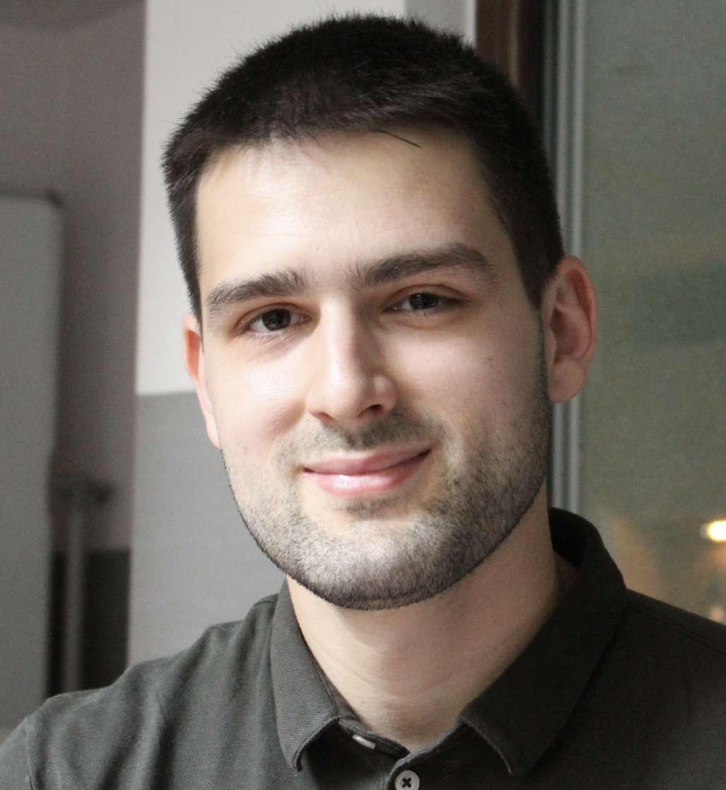
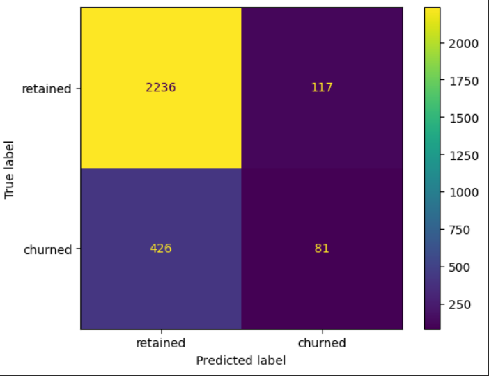

:::::: {.columns .g-col-4}
:::: {.column width="30%"}
{.circular width="100%"}

::: {style="text-align: center; font-size: 1.1em;"}
**Stefan Stojkovic**\
Data & Analytics Specialist

[Download CV (DE)](CV_Stojkovic.pdf){target="_blank"}

**Featured Project:** [Employee Turnover: ML classification](https://github.com/StojkovicS/employee_turnover){target="_blank"}\
`Snapshot:` Deployed ML models with \~92% recall on test set; reproducible notebook in the repo.

{width="90%" style="border-radius:8px; margin-top:0.7rem;"}
:::
::::

::: {.column .home-text width="59%"}
### About Me

Hi, I’m Stefan. I transform complex economic and policy data into reproducible analyses and actionable insights. With a background in quantitative research across psychology, political and economic sciences, I bridge the gap between raw data and strategic decision-making using R, Python, and SQL. Based in NRW Germany, with international experience in the Netherlands and Hungary.

I focus on reproducible workflows, causal and predictive analysis, and clear stakeholder communication (in English and German): designing robust studies, engineering and transforming features for reliable models, and translating results into concise recommendations decision-makers can act on.

I recently contributed through a 4.5 year contract to a European Research Council–funded project on political risk assessment across Europe (contract through January 30, 2026) and am now looking to transition into an analytics role where I can work closer to business problems and grow as a data science professional. I also maintain several side projects.

### What I bring

-   Domain knowledge in social and economic sciences combined with applied data science

-   Causal inference, Experimental design, Data governance

-   Hands-on experience engineering and transforming features for reliable statistical and ML models, including validation

-   Proven ability to lead small teams, manage analytic projects, and translate findings clearly to decision-makers

**Outside of work** I enjoy basketball, as well as following developments in energy and financial markets, media landscape and AI.

You can contact me at: [stojkovicstefan7\@gmail.com](mailto:stojkovicstefan7@gmail.com)\
Or via [LinkedIn](https://www.linkedin.com/in/stojkovicstefan/){target="_blank"}
:::
::::::
